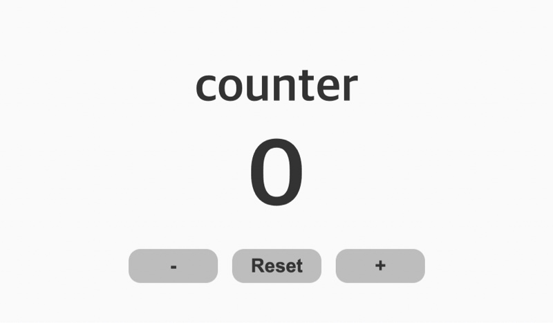
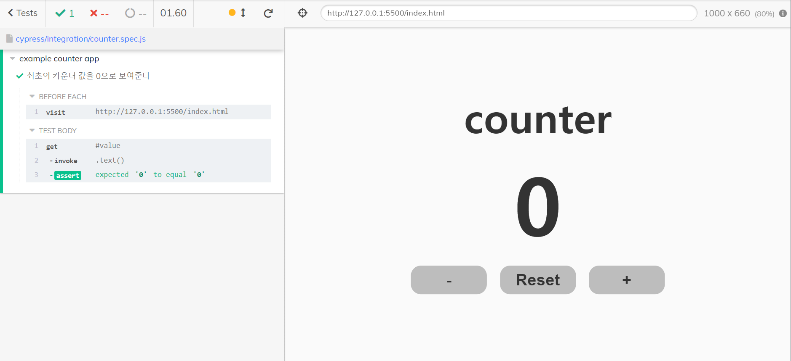

## [원본 깃허브 링크 🔥](https://github.com/blackcoffee-study/js-counter-test/tree/test/cypress)

## [인프런 강의 링크 🔥](https://www.inflearn.com/course/%EC%8B%B8%EC%9D%B4%ED%94%84%EB%A0%88%EC%8A%A4-%ED%85%8C%EC%8A%A4%ED%8A%B8/)

<br/>
<br/>

<p align="middle" >
  
</p>
<h2 align="middle">UI Counter</h2>
<p align="middle">테스트 코드 작성을 연습하기 위한 초간단 Counter 미션</p>
<p align="middle">
  
  
  
  
  
</p>

## 🔥 Projects!

<p align="middle">
  
</p>

<p align="middle">
  <a href="https://blackcoffee-study.github.io/js-counter-test/">🖥️ 데모 링크</a>
</p>

counter라는 간단한 미션을 통해서 Cypress라는 E2E 도구에 익숙해져보세요. 아래의 간단한 기능을 구현하면 쉽게 Cypress도구를 사용해보실 수 있습니다.

- [ ] counter의 초기값은 0이다.
- [ ] - 버튼을 클릭 시 count가 1증가한다.
- [ ] - 버튼을 클릭 시 count가 1감소한다.
- [ ] - 버튼을 클릭 시 count가 10이 넘는 경우 더이상 증가하지 못한다. (Max 값이 10)
- [ ] - 버튼을 클릭 시 count가 0보다 작아지는 경우 감소하지 못한다. (Min 값이 0)
- [ ] reset 버튼을 클릭 시 counter가 0으로 초기화된다.

## 👏🏼 Contributing

만약 미션 수행 중에 개선사항이 보인다면, 언제든 자유롭게 PR을 보내주세요.

<br>

## 🐞 Bug Report

버그를 발견한다면, [Issues](https://github.com/blackcoffee-study/js-counter-test/issues)에 등록해주세요.

<br>

## 📝 License

This project is [MIT](https://github.com/blackcoffee-study/js-counter-test/blob/main/LICENSE) licensed.

## [🔥 Get Start](https://docs.cypress.io/guides/getting-started/installing-cypress#Continuous-integration)

## 실행 방법

### 1. cypress 설치

```
$ npm install cypress --save-dev / yarn add cypress --dev
```

### 2. cypress 실행

```
$ ./node_modules/.bin/cypress open
```

### 3. cypress 디렉토리 생성확인

정상적으로 cypress가 실행된 경우, 우리의 레포지토리 내부에도 cypress 폴더가 생긴 것을 알 수 있다.

해당 폴더 내부에 `cypress/integration/1-getting-started/todo.spec.js` 경로를 통해 첫 번째 todo list 관련 테스트 코드가 작성되어 있음을 알 수 있다.

### 4. 작성하기

파일의 이름이 `xxx.spec.js` 인 이유는 해당 파일의 사양(= specification) 을 나타내기 때문이다.

### 5. 확인하기

<details>

<summary>최초 실행</summary>

<details>
<summary>최초 실행 코드</summary>

```js
describe("example counter app", () => {
  beforeEach(() => {
    cy.visit("http://127.0.0.1:5500/index.html");
  });

  it("최초의 카운터 값을 0으로 보여준다", () => {
    cy.get("#value").invoke("text").should("eq", "0");
  });
});

// describe: 어떤 어플리케이션인지 기술하는 부분
// beforeEach : 하나의 테스트 코드를 실행시키기 전에 매번 실행해주는 함수
// it : 테스트코드 작성

/** 메서드
 * visit : 방문할 주소의 url
 * get : 가져올 element node (querySelector)
 * invoke : 가져올 값
 * should : 가져올 값의 조건
 */
```

</details>

<br/>


</details>

## cypress 내부 메서드
